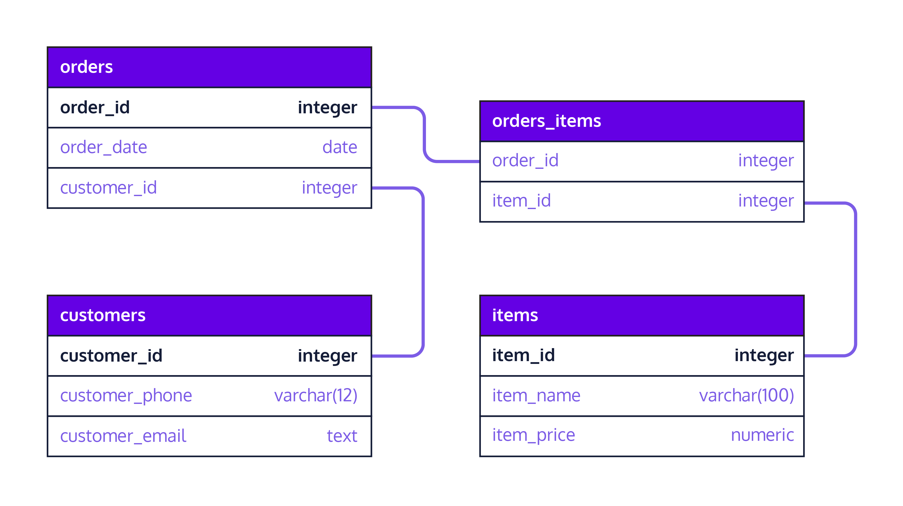

# Database Normalization at Fred's Furniture
A new online furniture store named Fred’s Furniture has hired you as their very first data engineer. Congratulations!

Fred (the owner) knew when he started his business that he should be collecting data about orders, customers, and items. Unfortunately, Fred doesn’t have a background in database engineering, so he has been storing all of this information in a single database table. Now that his business is getting a little bigger, Fred is finding it harder and harder to maintain his database, so he’s hired you to help him redesign it.

Over the course of this project, you will normalize Fred’s database by creating a new set of tables that contain all of the same information. You’ll then have a chance to explore how data modifications and queries differ before and after normalization.

The provided database includes order, customer, and item data for Fred’s first month of business, which is contained in a table named `store`. Press ‘Start’ to begin inspecting the data.

## Inspect the Data
1. Fred’s database, which contains a single table named `store`, has been loaded for you. Write a query to select the first 10 rows and all columns (`using SELECT *`) from the `store` table and inspect the results. In order to normalize the database, which columns do you think should be moved to separate tables?


2. Have any customers made more than one order? Copy and paste the following query into `script.sql` to calculate the number of distinct order_id values:
```
SELECT COUNT(DISTINCT(order_id)) 
FROM store;
```
Then, write another query using similar syntax to calculate the number of distinct `customer_id` values. You should see fewer customers than orders, suggesting that some customers have made more than one order!


3. Let’s inspect some of the repeated data in this table. Write a query to return the `customer_id`, `customer_email`, and `customer_phone` where `customer_id = 1`. How many orders did this customer make?


4. There’s probably even more repeated data in the item-related columns! Write a query to return the `item_1_id`, `item_1_name`, and `item_1_price` where `item_1_id = 4`. How many orders include this item as item_1?


## Create a Normalized Version of the Database
5. Below is a database schema for a normalized version of this database:



Use `CREATE TABLE customers AS` to create the `customers` table described in the schema by querying the original `store` table for the relevant columns. Make sure to only include one row per distinct `customer_id`.


6. Use the following syntax to designate the `customer_id` column as the primary key of your new `customers` table:
```
ALTER TABLE table_name
ADD PRIMARY KEY (column_name);
```
Note: You’ll need to use `ALTER TABLE` here because the `customers` table was created by querying an existing table; therefore, it was not possible to set a primary key constraint within the `CREATE TABLE` statement itself. You’ll also need to write this code AFTER the `CREATE TABLE` statement from the previous step because tables are deleted and re-created according to `script.sql` every time you press ‘Save’.


7. Use `CREATE TABLE` items AS to create the items table described in the normalized schema (diagram below) by querying the original store table for the relevant columns. Make sure to only include one row per distinct item_id.


8. Designate the `item_id` column of your new `items` table as the primary key.


9. Use `CREATE TABLE orders_items` AS to create the `orders_items` table described in the normalized schema (diagram below) by querying the original `store` table for the relevant columns. Each row should correspond to a unique instance of a particular item in a particular order.


The first few rows of the `orders_items` table should look something like:

| order_id |item_id | 
|----------|---------|
| 55       | 1       |
| 43       | 1       | 
| 64       | 2       | 
| 98       | 2       | 

Note that this table will allow you to retain the many-to-many relationship between orders and items (each order can contain multiple items; each item can appear in multiple orders).


10. Use `CREATE TABLE orders AS` to create the `orders` table described in the normalized schema (diagram below) by querying the original store table for the relevant columns. Note that you will want to include `customer_id` in the `orders` table so that you can still link `orders` and `customers` back together.


11. Designate the `order_id` column of the `orders` table as the primary key.


12. Copy and paste following code to designate the `customer_id` column of the `orders` table as a foreign key referencing the `customer_id` column of the `customers` table:
```
ALTER TABLE orders
ADD FOREIGN KEY (customer_id) 
REFERENCES customers(customer_id);
```
Then, use similar syntax to designate the `item_id` column of the `orders_items` table as a foreign key referencing the `item_id` column of the `items` table.


13. Designate the `order_id` column of the `orders_items` table as a foreign key referencing the `order_id` column of the `orders` table.


## Query your Databases!
14. Congratulations! You now have sets of database tables that contain the same information. The first has a single database table named `store`. The second has four database tables: `orders`, `orders_items`, `items`, and `customers`.

Due to the constraints of the learning environment on Codecademy, all of these tables are currently stored in the same database; however, for the remainder of this project, we are going to imagine them as separate databases (one that’s not normalized and one that is normalized) so that we can compare them.

Query the original `store` table to return the emails of all customers who made an order after July 25, 2019 (hint: use `WHERE order_date > '2019-07-25`').


15. Now, query your normalized database tables to return the emails of all customers who made an order after July 25, 2019 (the normalized database tables are: `orders`, `orders_items`, `customers`, and `items`). Is this easier or more difficult to do with the normalized database tables?


16. Query the original `store` table to return the number of orders containing each unique item (for example, two orders contain `item 1`, two orders contain `item 2`, four orders contain `item 3`, etc.)

Hint: you’ll need to use `UNION ALL` twice to stack the three `item id` columns on top of each other, then use the `WITH` key word to query the results of your union table using `COUNT` and `GROUP BY`.


17. Query your normalized database tables to return the number of orders containing each unique item. Is this easier or more difficult to do with the normalized database tables?


18. Experiment with the normalized and non-normalized database tables as much as you’d like! What types of queries are easier with the normalized tables? What types of queries are more difficult?

```
Other questions you might try to answer:

How many customers made more than one order? What are their emails?
Among orders that were made after July 15, 2019, how many included a 'lamp'?
How many orders included a 'chair'?
```