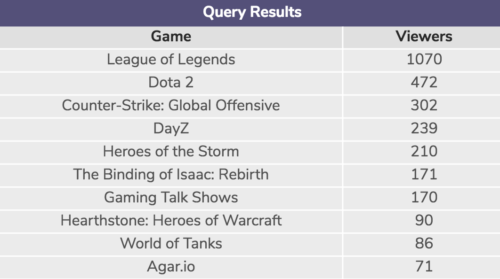
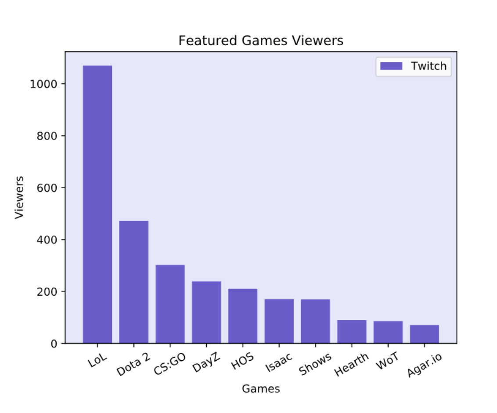
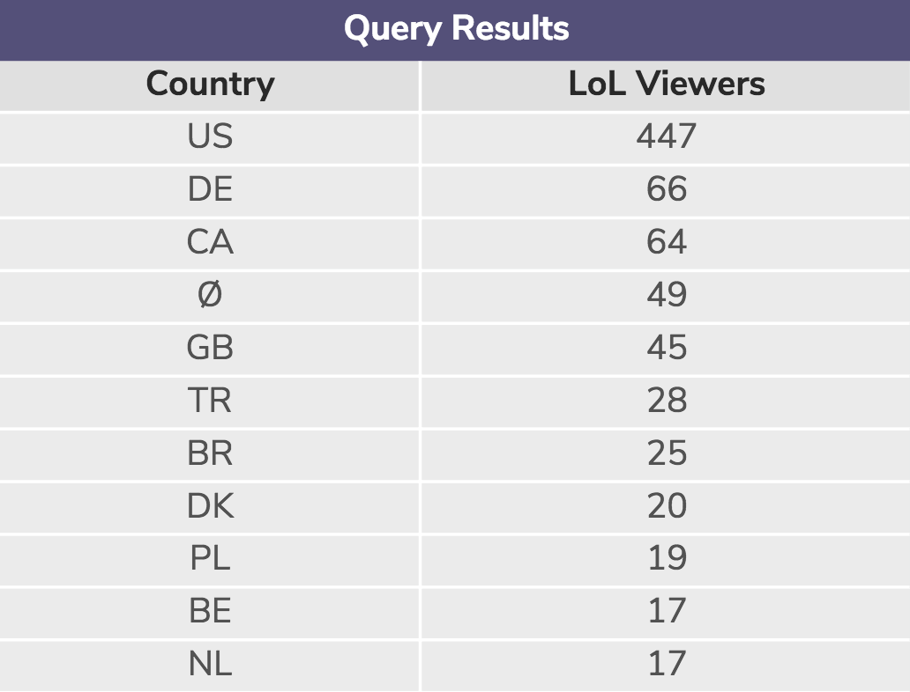
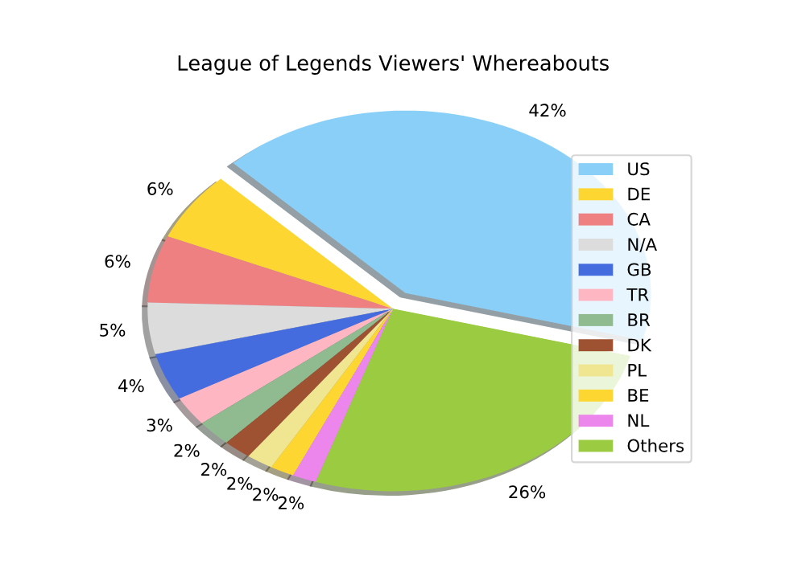
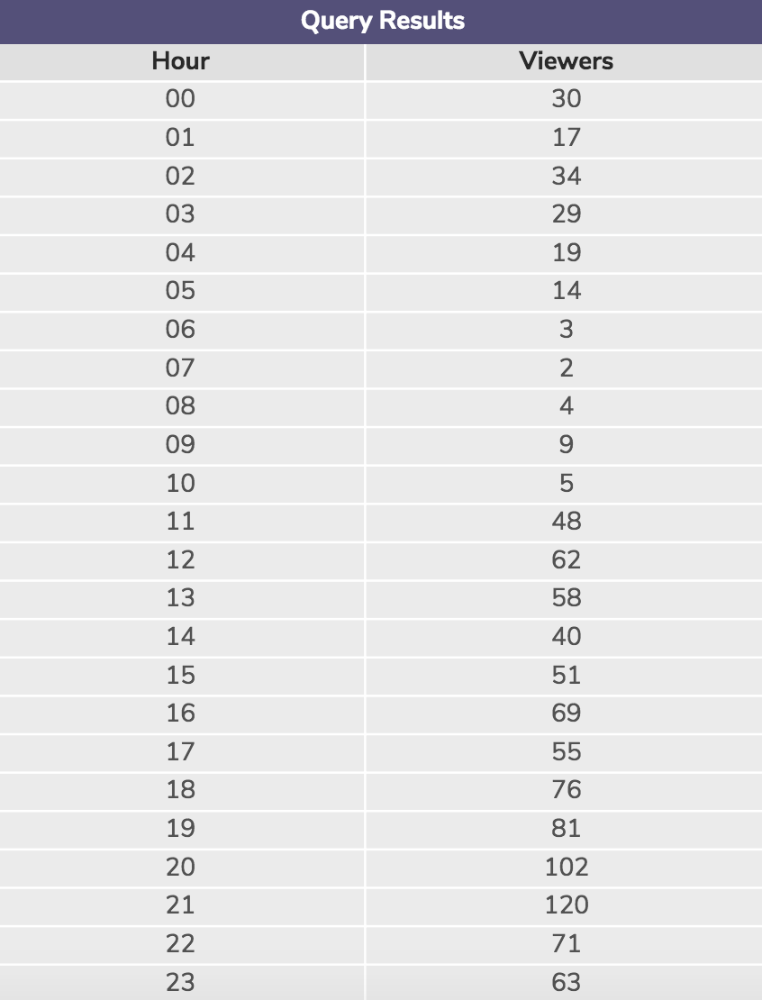
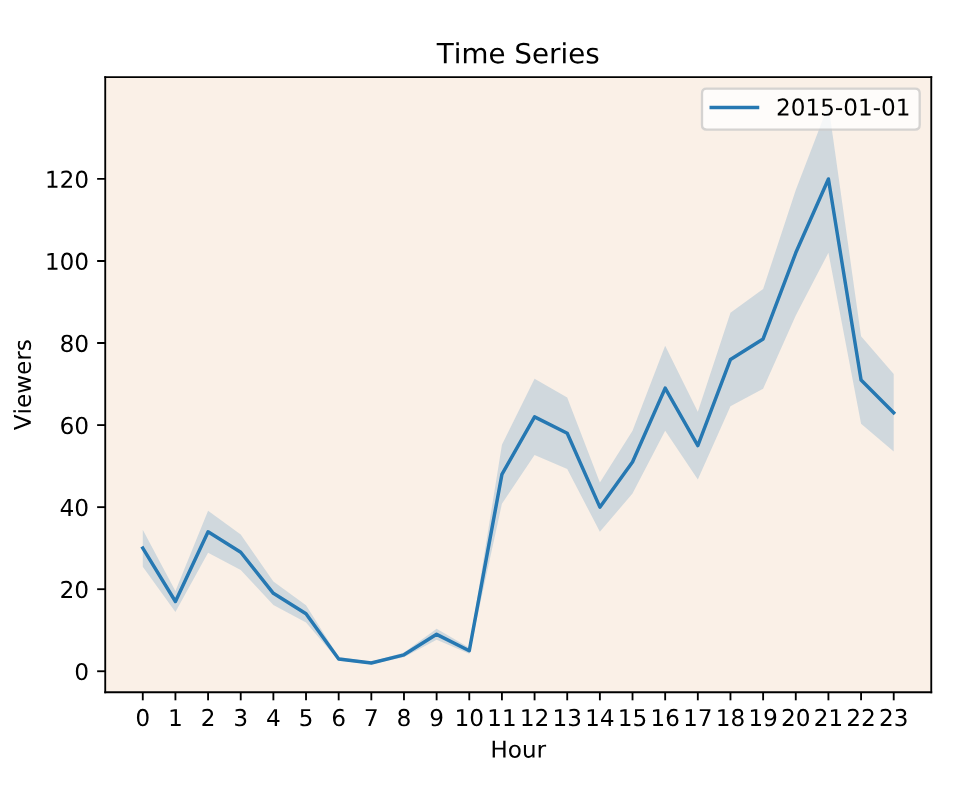

# Visualize Twitch Gaming Data

In this project, we will visualize Twitch data using Python and Matplotlib, in the forms of:

* **Bar Graph:** Featured Games
* **Pie Chart:** Stream Viewers’ Locations
* **Line Graph:** Time Series Analysis

The Twitch Science Team provided this practice dataset. You can download the **.csv** files (800,000 rows) from [GitHub](https://github.com/Codecademy-Curriculum/Codecademy-Learn-SQL-from-Scratch/tree/master/Twitch).

**Note:** This is data is scrubbed and is meant for practice use only.


## Bar Graph: Featured Games
1. Twitch’s home page has a [Featured Games](https://content.codecademy.com/projects/twitch/featured.png) section where it lists the “Games people are watching now”.

If we queried the Twitch practice dataset using SQL, we would get back the following list of the top 10 trending games (on January 1st, 2015) and their number of viewers:



In the next few tasks, you are going to take this data and plot a bar graph using Matplotlib.

Let’s get started!


2. The games and viewers are already loaded in the `script.py` file:

```py
games = ["LoL", "Dota 2", "CS:GO", "DayZ", "HOS", "Isaac", "Shows", "Hearth", "WoT", "Agar.io"]

viewers =  [1070, 472, 302, 239, 210, 171, 170, 90, 86, 71]
```

Now, use the `plt.bar()` to plot a bar graph using `range(len(games))` and viewers as arguments.

Feel free to pick a color, too (using `color='____'`).

Then, use `plt.show()` to visualize it.

3. Awesome, let’s make the graph more informative by doing the following:

* Add a title
* Add a legend
* Add axis labels
* Add ticks
* Add tick labels (rotate if necessary)

4. The visualization should look something like:


League of Legends really dominated the list on January 1st, 2015!


## Pie Chart: League of Legends Viewers' Whereabouts
5. There are 1070 League of Legends viewers from this dataset. Where are they coming from?

If we queried the Twitch practice dataset using SQL, our results would return the following:


As well as other countries that accounted for another 279 stream viewers.

In the next few tasks, you are going to take this data and make a pie chart.

Let’s get started!


6. The labels and countries are already loaded into script.py:

```py
labels = ["US", "DE", "CA", "N/A", "GB", "TR", "BR", "DK", "PL", "BE", "NL", "Others"]

countries = [447, 66, 64, 49, 45, 28, 25, 20, 19, 17, 17, 279]
```

Let’s add some colors!

Because there are 12 countries (including N/A and Others), let’s create an array called colors and add 12 color codes to it, like so:
```py
colors = ['lightskyblue', 'gold', 'lightcoral', 'gainsboro', 'royalblue', 'lightpink', 'darkseagreen', 'sienna', 'khaki', 'gold', 'violet', 'yellowgreen']
```
Check out the [Matplotlib color codes](https://matplotlib.org/examples/color/named_colors.html) to find your inner Bob Ross.

Then, use `plt.pie()` to plot a pie chart.

Don’t forget to throw in the `countries` variable and the `colors = colors`.

Lastly, use `plt.show()` to visualize it.


7. **Optional:** Let’s make it more visually appealing and more informative.

First, let’s “explode”, or break out, the 1st slice (United States):
``
explode = (0.1, 0, 0, 0, 0, 0, 0, 0, 0, 0, 0, 0)
``
Then, inside ``plt.pie()``, we are going to:
* Add the explode
* Add shadows
* Turn the pie 345 degrees
* Add percentages
* Configure the percentages’ placement

So it look something like:
```py
plt.pie(countries, explode=explode, colors=colors, shadow=True, startangle=345, autopct='%1.0f%%', pctdistance=1.15)
```
Also, we can add a title:
```py
plt.title("League of Legends Viewers' Whereabouts")
```
And legends:
```py
plt.legend(labels, loc="right")
```

8. The visualization should look something like:

Open the hint for the full code.


## Line Graph: Time Series Analysis
9. We were able to find the number of US viewers at different hours of the day on January 1st, 2015:


Let’s make this into a line graph.


10. The `hour` and `viewers_hour` area already loaded into script.py:
```py
hour = range(24)

viewers_hour = [30, 17, 34, 29, 19, 14, 3, 2, 4, 9, 5, 48, 62, 58, 40, 51, 69, 55, 76, 81, 102, 120, 71, 63]
```

Use `plt.plot()` to plot a line graph.

Don’t forget to throw in `hour` and `viewers_hour`.

Then, add the title, the axis labels, legend, and ticks.

Lastly, use `plt.show()` to visualize.


11. There is some uncertainty in these numbers because some people leave their browsers open. Let’s account for a 15% error in the `viewers_hour` data.

First, create a list containing the upper bound of the `viewers_hour` and call it `y_upper`.

Then, create a list containing the lower bound of the `viewers_hour` and call it `y_lower`.

Lastly, use `plt.fill_between()` to shade the error, with an `alpha` of 0.2.


12. Your line graph should look something like:


Look at the peak around 9 pm!

